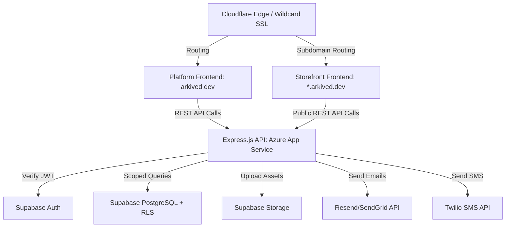

# System Design Document (SDD) — Arkived

**Project:** Arkived
**Date:** 2026-06-09
**Version:** 0.1.0
**Owner:** Regalia Council
**Status:** Draft
**Last reconciled:** 2026-06-09
**PRD:** [prd-arkived.md](prd-arkived.md)

---

## 1. Architectural Vision & Principles

**Architecture style:** Monolith API backend consumed by dual SPA frontends. 
- The backend is a stateless Express.js REST API.
- The platform frontend is a single-page app (SPA) for tenant management.
- The storefront frontend is a dynamically themed public SPA resolving tenant identities based on hostname.

**Guiding principles:**
- **Strict Data Isolation:** PostgreSQL Row-Level Security (RLS) is the primary line of defense. The API must never leak data across tenant boundaries.
- **Stateless API:** The Express API has no local session state; all authentication and authorization rely on verified JWTs.
- **Frontend Independence:** Frontends communicate with the API purely via standard REST endpoints over HTTPS.

**Key trade-offs made:**
- **No Monorepo Tooling:** We use standard folders (`platform/`, `storefront/`, `api/`) with separate dependencies to avoid monorepo configuration complexity, at the cost of slight duplication in boilerplate/types.
- **Client-Side Rendering (CSR):** Storefront is CSR (Vite + React 19) for simple deployment. SEO is managed via React 19's native metadata hoisting, trading off SSR performance for hosting simplicity.
- **Manual Payments for MVP:** Stripe payments are deferred to v2.0; payments are logged manually by staff using a `payment_reference` text field.

---

## 2. High-Level Architecture



### Layers

| Layer | Technology | Responsibility |
|-------|------------|----------------|
| Platform Client | Vite + React 19 + Tailwind v4 | Marketing site, onboarding, tenant dashboard, owner panel. |
| Storefront Client | Vite + React 19 + Tailwind v4 | Dynamic tenant storefront template; loads custom branding at runtime. |
| API / Gateway | Node.js + Express.js | Route endpoints, authentication middleware, Zod validation, request routing. |
| Data / Auth | Supabase (PostgreSQL + Auth) | Row-Level Security (RLS) database, user auth management, file storage. |
| Infrastructure | Azure App Service + Cloudflare | Web hosting, SSL termination, DDoS protection, wildcard subdomains. |

---

## 3. Data Architecture

**Primary database:** Supabase PostgreSQL — *reason: Built-in Row-Level Security (RLS), Postgres power, and seamless integration with Supabase Auth.*
**Storage:** Supabase Storage — *reason: Scoped to tenant folder structures and protected by RLS.*

### Backend Schema

#### Table: `tenants`

| Column | Type | Null? | Default | Key / Index | Constraint |
|--------|------|-------|---------|-------------|------------|
| `id` | UUID | No | `gen_random_uuid()` | PK | — |
| `slug` | TEXT | No | — | UNIQUE idx | Alphanumeric, hyphens, 3-32 chars |
| `name` | TEXT | No | — | — | — |
| `logo_url` | TEXT | Yes | — | — | — |
| `accent_color`| TEXT | No | `#6366f1` | — | Valid hex code |
| `plan` | TEXT | No | `starter` | — | `starter`, `pro`, `enterprise` |
| `created_at` | TIMESTAMPTZ | No | `now()` | — | — |

#### Table: `users`

| Column | Type | Null? | Default | Key / Index | Constraint |
|--------|------|-------|---------|-------------|------------|
| `id` | UUID | No | — | PK, FK | FK → `auth.users.id` |
| `tenant_id` | UUID | No | — | FK, IDX | FK → `tenants.id` |
| `role` | TEXT | No | — | — | `admin`, `staff` |
| `full_name` | TEXT | Yes | — | — | — |
| `created_at` | TIMESTAMPTZ | No | `now()` | — | — |

#### Table: `equipment`

| Column | Type | Null? | Default | Key / Index | Constraint |
|--------|------|-------|---------|-------------|------------|
| `id` | UUID | No | `gen_random_uuid()` | PK | — |
| `tenant_id` | UUID | No | — | FK, IDX | FK → `tenants.id` |
| `name` | TEXT | No | — | IDX | — |
| `description` | TEXT | Yes | — | — | — |
| `category` | TEXT | No | — | IDX | — |
| `daily_rate` | DECIMAL(10,2)| No| — | — | Must be >= 0 |
| `deposit` | DECIMAL(10,2)| No| `0.00` | — | Must be >= 0 |
| `quantity` | INTEGER | No | `1` | — | Must be >= 1 |
| `status` | TEXT | No | `available`| — | `available`, `rented`, `maintenance`, `archived` |
| `condition` | TEXT | No | `good` | — | `excellent`, `good`, `fair`, `repair` |
| `tags` | TEXT[] | Yes | — | — | — |
| `created_at` | TIMESTAMPTZ | No | `now()` | — | — |
| `deleted_at` | TIMESTAMPTZ | Yes | — | IDX | Soft-delete timestamp |

#### Table: `equipment_images`

| Column | Type | Null? | Default | Key / Index | Constraint |
|--------|------|-------|---------|-------------|------------|
| `id` | UUID | No | `gen_random_uuid()` | PK | — |
| `equipment_id` | UUID | No | — | FK, IDX | FK → `equipment.id` ON DELETE CASCADE |
| `storage_url` | TEXT | No | — | — | — |
| `is_primary` | BOOLEAN | No | `false` | — | — |
| `display_order`| INTEGER | No | `0` | — | — |

#### Table: `customers`

| Column | Type | Null? | Default | Key / Index | Constraint |
|--------|------|-------|---------|-------------|------------|
| `id` | UUID | No | `gen_random_uuid()` | PK | — |
| `tenant_id` | UUID | No | — | FK, IDX | FK → `tenants.id` |
| `full_name` | TEXT | No | — | IDX | — |
| `email` | TEXT | Yes | — | — | — |
| `phone` | TEXT | Yes | — | — | — |
| `notes` | TEXT | Yes | — | — | — |
| `created_at` | TIMESTAMPTZ | No | `now()` | — | — |

#### Table: `bookings`

| Column | Type | Null? | Default | Key / Index | Constraint |
|--------|------|-------|---------|-------------|------------|
| `id` | UUID | No | `gen_random_uuid()` | PK | — |
| `tenant_id` | UUID | No | — | FK, IDX | FK → `tenants.id` |
| `equipment_id` | UUID | No | — | FK, IDX | FK → `equipment.id` |
| `customer_id` | UUID | No | — | FK, IDX | FK → `customers.id` |
| `start_date` | DATE | No | — | IDX | — |
| `end_date` | DATE | No | — | IDX | — |
| `status` | TEXT | No | `reserved` | — | `reserved`, `payment`, `dispatched`, `returned`, `inspected`, `closed` |
| `total_amount` | DECIMAL(10,2)| No| — | — | — |
| `deposit_paid` | BOOLEAN | No | `false` | — | — |
| `payment_reference`| TEXT | Yes | — | — | — |
| `dispatch_condition`| TEXT| Yes | — | — | — |
| `return_condition`| TEXT | Yes | — | — | — |
| `overdue` | BOOLEAN | No | `false` | IDX | — |
| `created_at` | TIMESTAMPTZ | No | `now()` | — | — |

#### Table: `maintenance_logs`

| Column | Type | Null? | Default | Key / Index | Constraint |
|--------|------|-------|---------|-------------|------------|
| `id` | UUID | No | `gen_random_uuid()` | PK | — |
| `tenant_id` | UUID | No | — | FK, IDX | FK → `tenants.id` |
| `equipment_id` | UUID | No | — | FK, IDX | FK → `equipment.id` |
| `service_date` | DATE | No | — | — | — |
| `service_type` | TEXT | No | — | — | `routine`, `repair`, `inspection`, `cleaning` |
| `performed_by` | TEXT | Yes | — | — | — |
| `notes` | TEXT | Yes | — | — | — |
| `cost` | DECIMAL(10,2)| Yes| — | — | — |
| `next_service_due`| DATE | Yes | — | IDX | — |
| `created_at` | TIMESTAMPTZ | No | `now()` | — | — |

### Key Relationships
- `tenants` is the parent table for all scoped tenant data.
- `users` link to Supabase Auth `auth.users` (1:1) and belong to a `tenant` (N:1).
- `equipment`, `customers`, `bookings`, `maintenance_logs` are all owned by a specific `tenant_id`.

### Migration Strategy
Migrations are managed in Supabase SQL using standard schema migration patterns. Every schema update must be backward compatible to allow seamless deployment rollbacks.

---

## 4. API Design & External Integrations

**API style:** REST API via Express.js

### Key Endpoints

| Method | Path | Purpose |
|--------|------|---------|
| `POST` | `/api/v1/auth/register` | Tenant self-registration & workspace creation. |
| `GET` | `/api/v1/tenant/:slug/public` | Resolves public branding configuration for storefront. |
| `GET` | `/api/v1/me` | Fetch user context and active tenant membership. |
| `GET` | `/api/v1/equipment` | Search and filter tenant's catalog (auth required). |
| `POST` | `/api/v1/equipment` | Create a new equipment listing. |
| `GET` | `/api/v1/bookings/calendar` | Fetch booking slots formatted for calendar views. |
| `PATCH` | `/api/v1/bookings/:id/status`| Transition booking statuses through the workflow. |

### External Integrations

| Service | Purpose | Rate Limits / Fallback |
|---------|---------|------------------------|
| Supabase Auth | User authentication & JWT generation. | Managed service limits; fallback to client-side caching. |
| Cloudflare Pages | Hosting static frontends. | Global CDN; unlimited bandwidth. |
| Azure App Service | REST API hosting. | Scaled instances behind Azure load balancers. |
| Resend | Transactional notifications. | Rate limits handled via exponential backoff retries. |

---

## 5. Security & Authorization

### Multi-Tenant Isolation
Row-Level Security (RLS) is enabled on all tables (except `tenants` public-read fields).
A Postgres trigger populates tenant context, and RLS policies prevent users from writing or reading data from outside their assigned `tenant_id`.

```sql
CREATE POLICY tenant_isolation ON equipment
  FOR ALL USING (tenant_id = (SELECT tenant_id FROM users WHERE id = auth.uid()));
```

### Input Validation
Every Express endpoint uses `zod` schemas to strictly validate request parameters, queries, and body payloads.

### Environment & Secrets
No credentials or tokens are committed. Local development uses `.env`, and production relies on Azure App Service environment variables and Supabase secret managers.

---

## 6. Infrastructure, CI/CD & Deployment

- `dev`: Local development running Vite frontends and local Express server connected to a staging Supabase instance.
- `prod`: 
  - Frontends deployed to Cloudflare Pages.
  - API hosted on Azure App Service.
  - Supabase database hosted in production tier.

---

## 7. Non-Functional Requirements

| Requirement | Target | Notes |
|-------------|--------|-------|
| API response (p95) | < 300ms | Direct DB query optimization via indexes. |
| Uptime | 99.9% | Ensured by Azure auto-scale + Supabase architecture. |
| Frontend Performance | Lighthouse >= 85 | Achieved via asset optimization and lazy-loading in Vite. |
| Data isolation leakage | 0 instances | Validated via automatic integration tests checking multi-tenant queries. |
